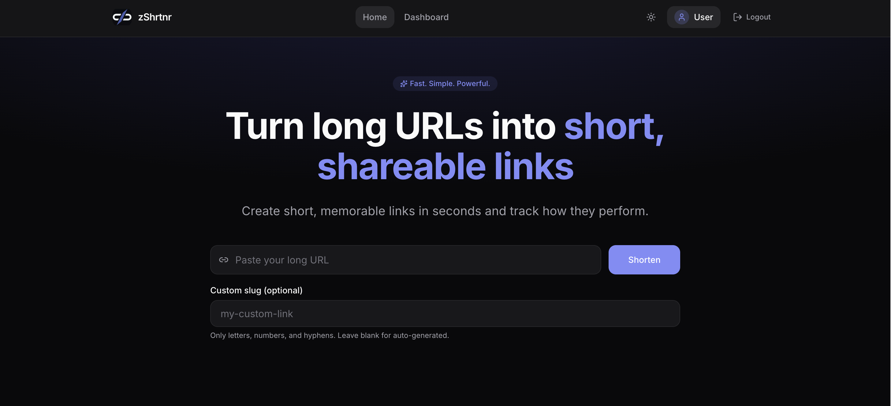
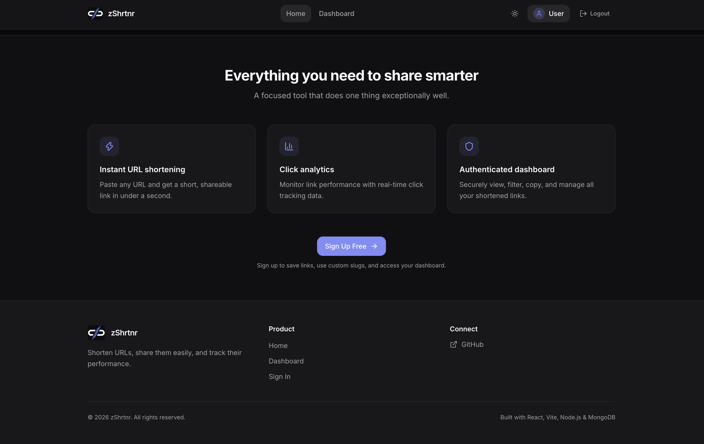
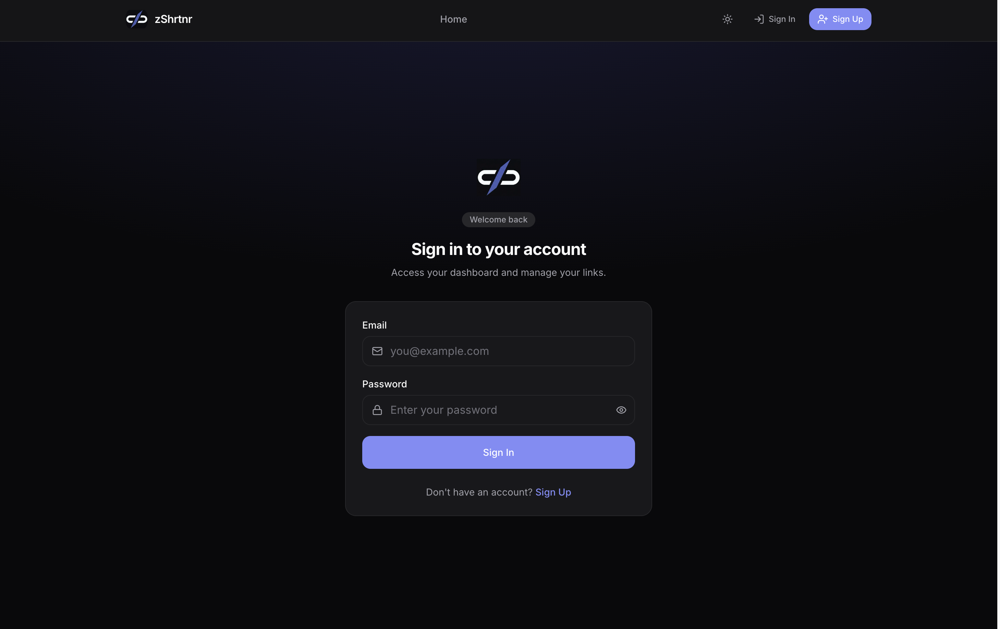
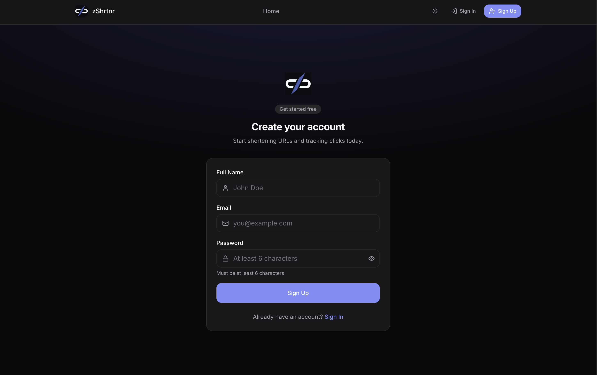
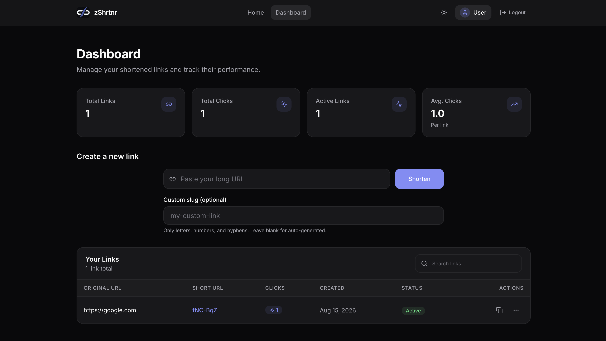
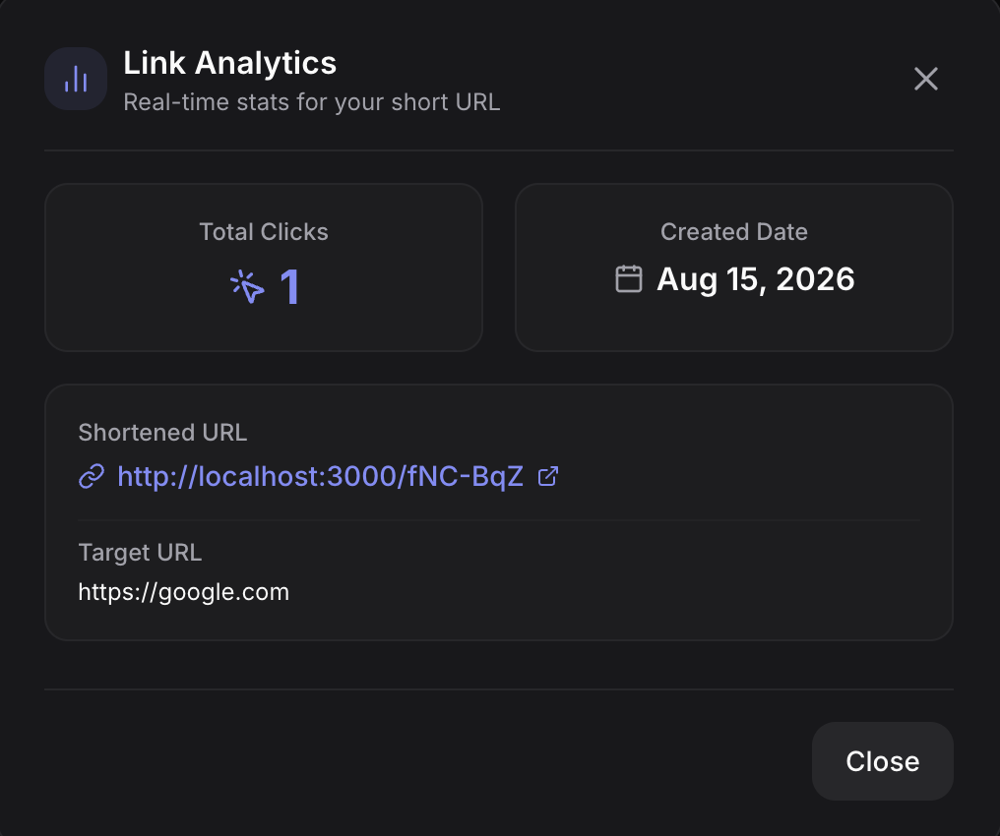

# zShrtnr 🔗

A modern full-stack URL shortener that lets users create short, shareable URLs, manage their links, and track their performance through an authenticated dashboard.

## 🌐 Live Demo

**Live Application:**
https://zshrtnr.onrender.com

**Backend API:**
https://zshrtnr-api.onrender.com

**GitHub Repository:**
https://github.com/yashahirrr/zshrtnr

---

## ✨ Features

- 🔗 Create short URLs from long URLs
- ⚡ Fast and unique URL generation using Nano ID
- 🔄 Automatic redirection from short URLs
- 🔐 User registration and login
- 🍪 JWT authentication using HTTP-only cookies
- 🛡️ Protected dashboard routes
- 📊 Click tracking and URL analytics
- 📋 View and manage shortened URLs
- 📱 Responsive design
- 🌙 Dark/light theme support
- 🎨 Modern component-based UI
- 🚀 Production deployment using Render
- 🗄️ MongoDB Atlas database
- 🔒 Environment-based configuration
- ❤️ Custom branding and favicon

---

## 🖥️ Screenshots

### Home Page

### Sign In Page

### Sign Up Page

### Dashboard Page

### Link Analytics

## Application Architecture

                        ┌──────────────────┐
                        │      User        │
                        │     Browser      │
                        └────────┬─────────┘
                                 │
                                 ▼
                    ┌─────────────────────────┐
                    │     React Frontend      │
                    │                         │
                    │  Vite                   │
                    │  TanStack Router        │
                    │  Redux Toolkit          │
                    │  Axios                  │
                    │  Tailwind CSS           │
                    └────────────┬────────────┘
                                 │
                              REST API
                                 │
                                 ▼
                    ┌─────────────────────────┐
                    │     Express Backend     │
                    │                         │
                    │  Authentication         │
                    │  URL Shortening         │
                    │  URL Redirects          │
                    │  Analytics              │
                    │  Protected Routes       │
                    └────────────┬────────────┘
                                 │
                                 ▼
                    ┌─────────────────────────┐
                    │      MongoDB Atlas      │
                    │                         │
                    │  Users                  │
                    │  Short URLs             │
                    │  Click Data             │
                    └─────────────────────────┘

## 🛠️ Tech Stack

* Frontend
* React.js
* Vite
* Tailwind CSS
* TanStack Router
* Redux Toolkit
* Axios
* Lucide React
* Backend
* Node.js
* Express.js
* MongoDB
* Mongoose
* JWT
* bcrypt
* Nano ID
* Cookie Parser
* CORS
* dotenv
* Deployment & Services
* GitHub
* Render
* MongoDB Atlas

## ⭐ Support
  If you found this project useful, consider giving the repository a ⭐ on GitHub.